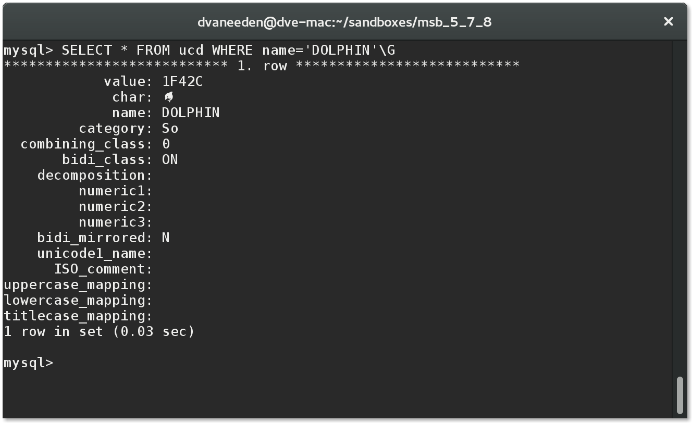

Description
===========

The unicode data in MySQL format.

| File                | Description |
| --------------------|-------------|
| `mysqlunicodedb.py` | The script to download the data and create the tables |
| `requirements.txt`  | To support `pip3 install -r requirements.txt` |
| `ucd_data.sql`      | The data as generated by the script |
| `ucd_schema.sql`    | The schema as generated by the script |

Fonts
=====

This database contains characters in many different scripts. You might
want to install additional fonts for each script to be able to
display the characters.

For example to display emoji fonts on a Linux machine you might want to
install these:

* google-noto-color-emoji-fonts
* google-android-emoji-fonts
* gdouros-symbola-fonts

License
=======

for `ucd_data.sql` the data originates from UnicodeData.txt
For which the license can be found here:
http://www.unicode.org/copyright.html#Exhibit1

All other files are licensed under GPLv3
